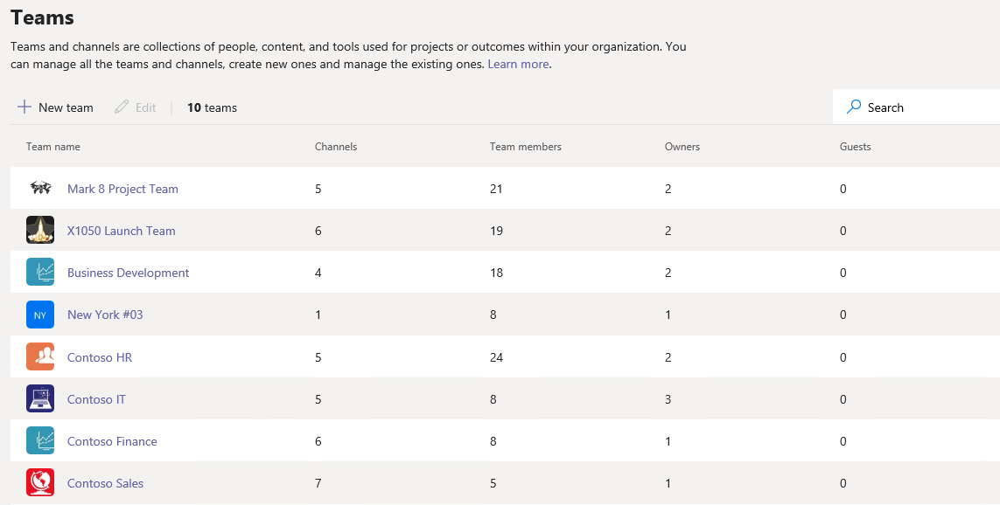

# **Lab 01 - Office 365 Management Interfaces**

## Activate Microsoft Teams Introduction

Welcome!  You are the new Teams Administrator for Contoso Corp!  In your new role, you will deploy and manage Microsoft Teams for Contoso.  The following labs will help you learn how to perform the tasks required of a Microsoft Teams Administrator. Let's begin!

To help you get started quickly, we have already enabled your Microsoft 365 Tenant and credentials for access.  You are a Global Administrator of all functions within Office 365 and Azure Active Directory.  Your Tenant credentials are listed under the **Content** tab in the LOD environment.  
___
@lab.o365username = admin@m365x819544.onmicrosoft.com
>[!alert] ***Your credentials will look similar to this, but these are **NOT YOUR CREDENTIALS!!***

**Estimated Time:** 10 minutes 

**Objectives:** 
This lab focuses on the following tasks:
- Preparing your workstation to administer Microsoft Teams and it's dependencies
- Preparing the Microsoft 365 Tenant for future labs
<br>
<br>
>[!hint]When you see the copy icon ++_++ You can copy the highlighted text into the lab.  
<br>
<br>

___
===
###**Exercise 01: Office 365 Management Interfaces**
In this exercise you will be introduced to the management interfaces that are available in Microsoft 365 for managing Microsoft Teams and then prepare them for use in later labs.

**Client Credentials**
    Use the following credentials to log in to **Client01**  

>[!hint] If you see this icon @lab.VirtualMachine(Client01).SelectLink  
**click** it to automatically switch to that machine in the lab!  


**Username: ** ++@lab.VirtualMachine(Client01).Username++   
**Password: ** ++@lab.VirtualMachine(Client01).Password++

1. [ ] Log in to **Client01** using the above credentials
2. [ ] From the Start menu or the Taskbar, open **Windows PowerShell** as an Administrator

    >[!note] To make it easier to log in to each module, we will use a PowerShell Variable to save our Office 365 credentials for this session.

    ```powershell-notab
    $credential = Get-Credential
    ```
    Use the Office 365 Tenant credentials supplied to you in the Resource Tab to authenticate when the Windows PowerShell Logon window opens

    **O365 Admin Username:** ++@lab.TextBox(O365AdminUsername)++  
    **O365 Admin Password:** ++@lab.TextBox(O365AdminPassword)++

   ](media/get-cred.png)
    
    >[!alert] ***if you close this PowerShell session window,  you will lose this variable and will need to type it in again!***

3. [ ] Import the Microsoft Office 365 Online PowerShell Module
    ```PowerShell-notab
    Import-Module MSOnline
    ```

4. [ ] Connect to the MSOnline Session by typing this cmdlet:
    ```PowerShell-notab
    Connect-MsolService -Credential $credential
    ```

5. [ ] Test the MSOnline PowerShell Module by typing the following cmdlet:  
    ```PowerShell-notab
    Get-MSOLAccountSku
    ```
    You should see a listing of the Account SKUs (Licenses) assigned to your tenant similar to this:
   
  
6. [ ] Import the AzureAD PowerShell Module
    ```PowerShell-notab
    Import-Module AzureAD
    ```
7. [ ] Connect to the AzureAD Powershell Session by typing this cmdlet:
    ```PowerShell-notab
    Connect-MsolService -Credential $credential
    ```

8. [ ] Test the AzureAD PowerShell Module by typing the following cmdlet:
    ```PowerShell-notab
    Import-Module AzureAD
    ```
    You should see a listing of AzureAD Domains in tenant similar to this:
    
    
9. [ ] Install the Microsoft Teams PowerShell Module
    ```PowerShell-notab
    Import-Module MicrosoftTeams
    ```
    You will get a warning to install the module from an untrusted repository.  Type in Y to confirm the installation
    
    
    
    >[!note] This message is due to the 'PSGallery' repository, where the Teams Module is currently being serviced from, is not in the default InstallationPolicy included with Windows 10.  The module is safe and you can safely ignore this message.
    
10. [ ] Connect to the Microsoft Teams Powershell Session
    ```PowerShell-notab
    Connect-MicrosoftTeams -Credential $credential
    ```
    Once connected successfully you should see output that is similar to this:
    
    
11. [ ] View the any Microsoft Teams you may already have in your environment
    ```PowerShell-notab
    Get-Team  
    ```
    You should see output that is similar to this:
    
    Notice that this cmdlet by default shows you the O365 GroupID, DisplayName of the Team and the description of the Team as entered when the Team was created.
    
    Leave the PowerShell Window open for the next task, we will come back to it in the next exercise.
    
12. [ ] Open Internet Explorer from either the Start Menu or Taskbar

13. [ ] Enter the URL for the Microsoft Teams and Skype for Business Admin Center    (https://admin.teams.microsoft.com/)
When prompted for authentication, click on the + before **Use another account** to enter your own tenant credentials

    
    
14. [ ] When the Admin Center loads, in the left main menu, click on **Teams**

    
    
    Review the list of teams in the Admin Center.  Compare it with the list in the Teams PowerShell Module.  They should be exactly the same.  
    
    
    
===

Prep lab with script
