# Lab 02 - Configuring your Tenant for Microsoft Teams
In this lab you will prepare your tenant for Microsoft Teams.  In the first exercise, you will configure Groups Based Licensing in AzureAD

## Exercise 01 - Navigate to the Azure AD Portal

1. [ ] Open Internet Explorer and navigate to the [Microsoft 365 Admin Portal](https://admin.microsoft.com).  If prompted, log in using the **cloud credentials** for your tenant, located in the Resource Tab.
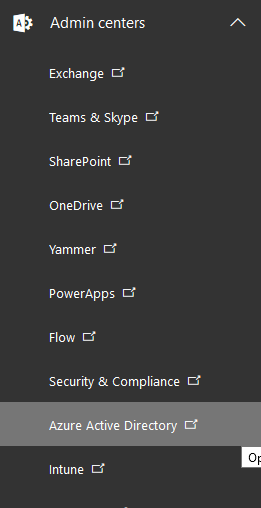
2. [ ] Click **Admin Centers** in the left navigation pane, and then select **Azure Active Directory**. A new window will open.  If prompted, log in using the **cloud credentials** for your tenant, located in the Resource Tab.

3. [ ] In the Azure Active Directory Admin Center left pane, select **Azure Active Directory** to open the Azure AD Overview pane

===

## Exercise 02 - Create a new Dynamic Azure AD Group

1. [ ] On the Azure Active Directory pane, Under **Manage** select **Groups** to open a pane where you can see and manage all licensable products in the tenant.
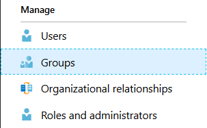

2. [ ] Click on **+New Group** to create a new security group.
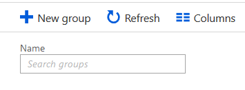

3. [ ] In the New Group pane, make the following choices and or enter the following text in the next four fields:  

    **Group Type:** Security  
    **Group Name:** Sales_Users  
    **Group Description:** Users in the Sales Department
    **Membership Type:** Dynamic User  
    
    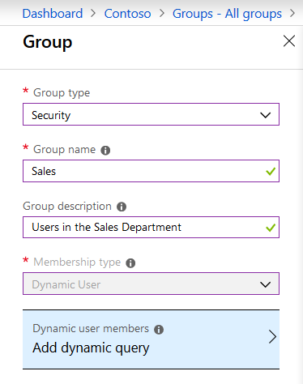  
    
4. [ ] Click on **Add Dynamic Query** to query Azure AD which members should be added to the new group.

5. [ ] In the Dynamic membership rules pane, click **Simple Rule** to create a rule using only one operator.
    >[!knowledge] You can always create more advanced membership rules by choosing **Advanced rule**.
    With advanced rules, there are three types of properties that can be used to construct a membership rule.  
        * Boolean  
       * String  
        * String collection  
    For this lab, we will keep it simple for now. 
    
6. [ ] User **Add users where** select the **Department** AAD Attribute.

7. [ ] In the next drop down menu, choose the **Contains** operator.

8. [ ] Type ++**Sales**++ into the field.

9. [ ] Click **Add query** to create the query and add it to the Group.

    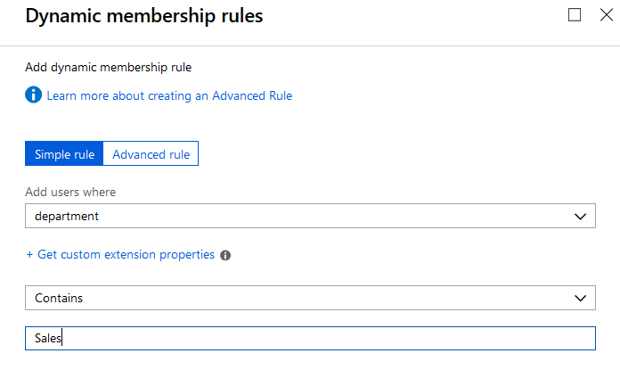
    

10. [ ] Click **Create** to create the Dynamic Group.

    >[!help] If your group was not created successfully, check the query and the info entered from above or check with your instructor.
    
    >[!alert] It may take a few minutes for the new Dynamic group to show up in the list and finish adding users to the goup.  Click **Refresh** to refresh the list.  
    >[!alert] Under **Membership Processing Status** it may say *Evaluating* until processing is *Complete*.  This may take a few minutes.  
    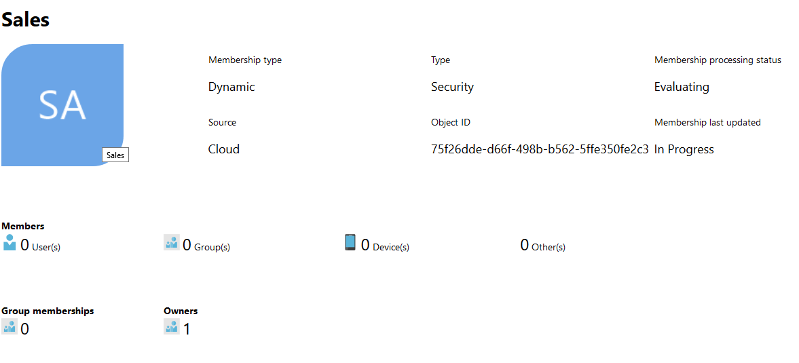  
    >[!alert] If it does not finish within 15 minutes, please inform your instructor. 
    
    When complete, you should see more than 0 Users under **Members** on the **Overview Page** for your Group
    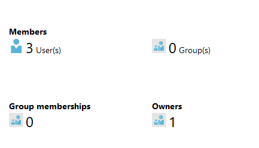

===

## Exercise 03 - Assign Licenses to the Group

1. [ ] On the Azure Active Directory pane, Under **Manage** select **Licenses** to open a pane where you can see and manage all licensable products in the tenant.
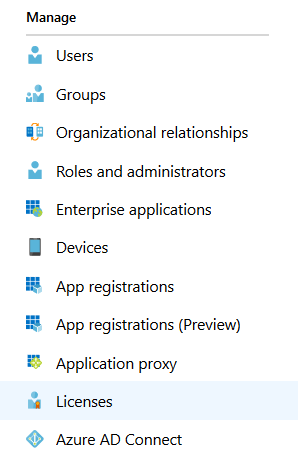

2. [ ]To start the assignment, select **Assign** at the top of the pane.  
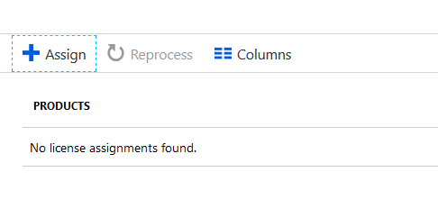

2. [ ] Click **Products**, click ***Configure required settings*** Select **Office 365 Enterprise E5** by selecting the checkbox next to the product names. Then click **Select**
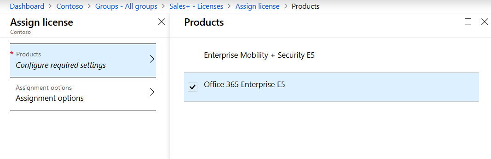

3. [ ] Click **Assignment options**, Under **Office 365 Enterprise E5**, Find **Microsoft Teams**
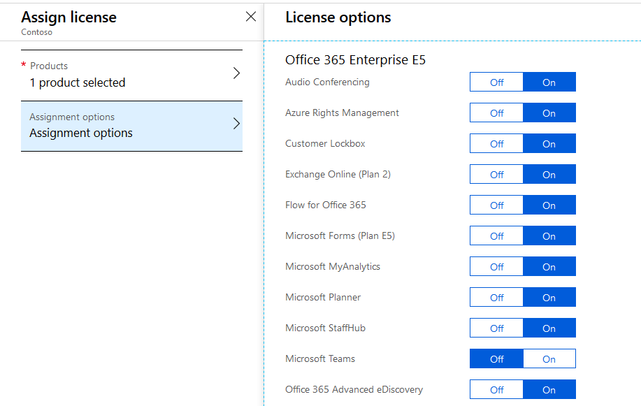

4. [ ] Enable Microsoft Teams for the group by selecting **On**. 

Confirm by clicking OK at the bottom of **Assignment** options.

5. [ ] Under **Assign License** the **Products** should now say **1 product selected** and **Assignment options** should say **Configured**.  If not, verify the steps above were completed.  Click on Assign
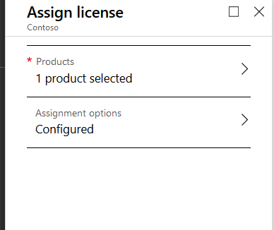

>[!note] This initial operation might take some time, depending on the current size of the group.
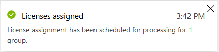

## Exercise 04 - Verify the License change was applied to the Sales users

6. [ ] Still within the **Sales Group** Overview pane, under **Manage** click on **Licenses**.  Then Click on **Office 365 Enterprise E5**.

7. [ ] Verify that **Microsoft Teams** is switched to **On**
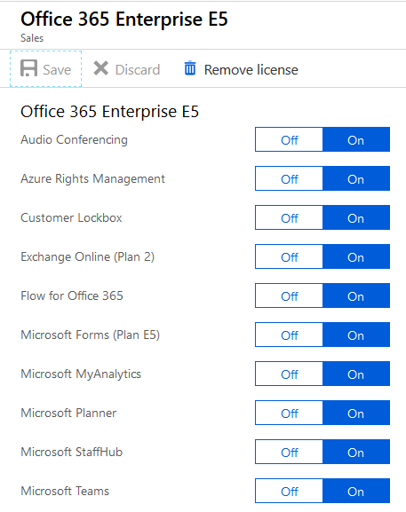

 >[!alert] If it is not yet switched to **On**, be patient.  Do not re-attempt the process for a least 24 hours.
 
8. [ ] Click on **Dashboard** in the **Azure Active Directory admin center** menu to leave this page.

===
In this lab, you created a new Dynamic Group in Azure Active Directory.  Then you enabled Microsoft Teams for the group using the Azure AD Group Based Licensing feature.  This feature allows you to easily control which M365 users can use a product or more than one product.  It makes piloting a new service easy as ever.  

## YOU HAVE COMPLETED THIS LAB! 
Click **Next** to continue and close this lab. 
 

