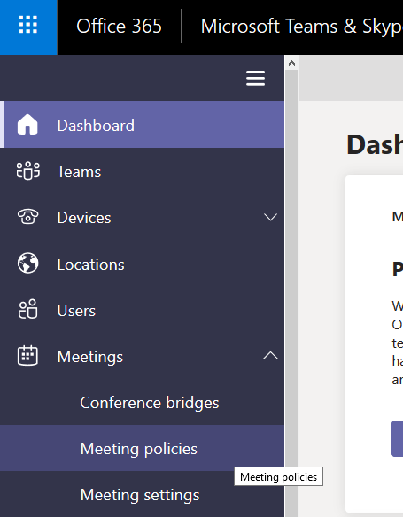
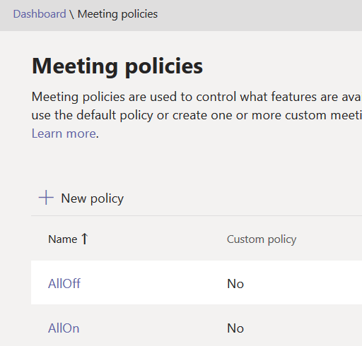
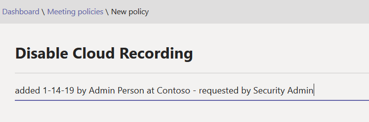
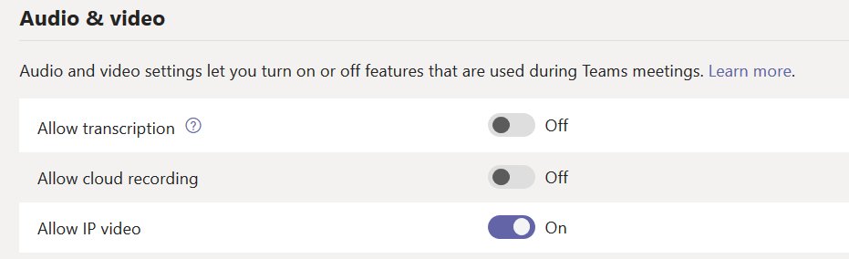
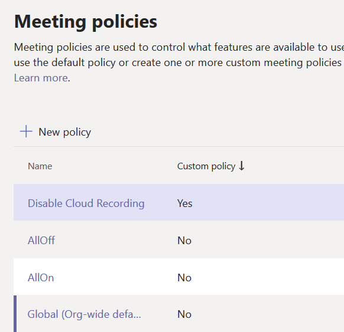
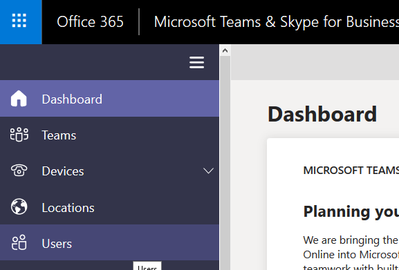
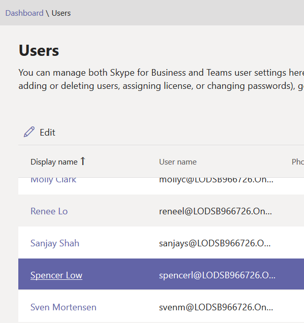
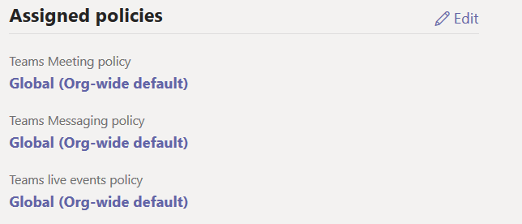
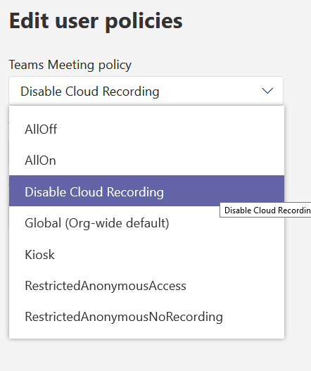
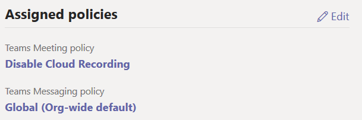

# Lab 07 - Create a custom Teams Meeting Policy

In this lab, your Security Admin has decided to not allow recording of meetings at this time.  So, we will create a new Custom Teams Meeting policy to disable the the cloud recording feature in Teams Meetings.  In the second exercise, you will apply it to a single user.  

Click **next** to begin!

===

>[!note] **Client Credentials**
    Use the following credentials to log in to **Client01**  
    **Username:** ++@lab.VirtualMachine(Client01).Username++   
    **Password:** ++@lab.VirtualMachine(Client01).Password++

#### Exercise #1 Create a Custom Meeting Policy

1. [ ] Log in to **Client01** using the above credentials

2. [ ] On **Client01** open **Internet Explorer** and navigate to the **Microsoft Teams and Skype for Business Admin Center** (https://admin.teams.microsoft.com/)  

    When prompted for authentication, click on the **+** before **Use another account** to enter your own tenant credentials
    
3. [ ] In the Microsoft Teams and Skype for Business Admin Center, on the left side menu, navigate to **Meetings** then **Meeting Polcies**
    
    

4. [ ] Click the on the **+** in front of **New Policy**
    
    

5. [ ] Name the policy **"Disable Cloud Recording"**
    
    

6. [ ] Scroll down to the **Audio & Video** section of the frame.  Find the **Allow cloud recording** setting.  Toggle the button to **Off**
    
    
    
7. [ ] Click **Save**.

8. [ ] You should see your new custom policy in the list (it may be at the bottom, depending on how the list is sorted)
    
    

**KEEP THE MICROSOFT TEAMS AND SKYPE ADMIN CENTER OPEN!!**

Click **Next** to see how we apply this to a user.  

===

#### Exercise #2 Apply a Custom Meeting Policy to a User

1. [ ] In the Microsoft Teams and Skype for Business Admin Center, on the left side menu, navigate to **Users**.
    
    
  
2. [ ] Find and then click the user **"Spencer Low"** to edit his settings.

    
    
3. [ ] Scroll down to the **Assigned Policies** section.  Click **Edit**

    
    
4. [ ] A new flyout window will be on the right.  Under **Teams Meeting Policy**, click the drop down menu and select the new custom policy we created in the previous exercise named **"Disable Cloud Recording"**
    
    
    
5. [ ] Click **Save**.
    
    You should now see the your new Custom Meeting Policy listed under **Teams Meeting Policy**.
    
    
    
#### You have completed this lab!