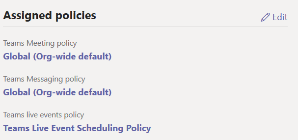

# Lab 09 - Enable Teams Live Events

In this lesson, You will enable a user the ability to schedule Teams Live Events using a custom policy.  Your security team has also requested that you disable recording of Live Events for everyone except the organizer of a Live Event.  

Click **next** to begin!

===

>[!note] **Client Credentials**
    Use the following credentials to log in to **Client01**  
    **Username:** ++@lab.VirtualMachine(Client01).Username++   
    **Password:** ++@lab.VirtualMachine(Client01).Password++
    
#### Exercise #1 - Create a new Live Event Policy to allow certain users to schedule Live Events

1. [ ] Log in to **Client01** using the above credentials

2. [ ] On **Client01** open **Internet Explorer** and navigate to the **Microsoft Teams and Skype for Business Admin Center** (https://admin.teams.microsoft.com/)  

    When prompted for authentication, click on the **+** before **Use another account** to enter your own tenant credentials
    
>[!knowledge] Typically users are enabled for Microsoft Stream  by default on the *Office 365 Enterprise E5 and E3* plans.  Your own organization's licensing plan may be different.  <br><br>
A Microsoft Teams, Microsoft Stream and Skype for Business license is required to schedule a Teams Live event.    <br><br>

3. [ ] In the Microsoft Teams and Skype for Business Admin Center, on the left side menu, navigate to **Meetings** then click on **Live events policies**.

    

    Because you want to control who can schedule Teams Live Events, we will create a new custom Live Events Policy and disable it in the Global policy.

4. [ ] Click on **+ New Policy** to create a custom policy
    
    
    
5. [ ] Type in a **Name** your new policy.  In the example below, we will call it **Teams Live Event Scheduling Policy**

6. [ ] Toggle the button to **On** next to **Allow Scheduling**

7. [ ] In the dropdown menu next to **Recording Setting** and choose **Organizer can record**

    

8. [ ] Click **Save** to save the policy.

9. [ ] You should now see the new policy in the list of Live Events Policies.
    
    

**YOU HAVE FINISHED THIS EXERCISE**

Click **Next** to move on to edit the Global policy.

===

#### Exercise #2 - Edit the Global policy

1. [ ] Under **Live Events Policies**, click on the **Global (Org-Wide Default) Policy**

2. [ ] Toggle the button to **OFF** next to **Allow Scheduling**

    

7. [ ] In the dropdown menu next to **Recording Setting** and choose **Organizer can record**

    
    
8. [ ] Click **Save** to save the policy.

**YOU HAVE FINISHED THIS EXERCISE**

Click **Next** to move on to edit the Global policy.

===

1. [ ] In the Microsoft Teams and Skype for Business Admin Center, on the left side menu, navigate and click on **Users**

    
    
2. [ ] Find the and **click on** **Dan Jump** in the list of users.

    
    
3. [ ] In Dan Jump's properties, scroll down to **Assigned Policies** on the left.  Click on **Edit**
    
    
4. [ ] In the flyout window on the right, under **Teams Live Event Policy**, use the dropdown menu and select **the new Live Event Policy** you just created.  

    
    
5. [ ] Click **Save**

6. [ ] You should see the new settings under the **Assigned Policies** section of the frame. 

    
    
>[!knowledge] You can use the following Windows PowerShell cmdlet examples to set and assign Live Events policy settings for multiple users:  <br><br>

**Disable live events scheduling**
```powershell
Set-CsTeamsMeetingBroadcastPolicy -identity Global -AllowBroadcastScheduling $false
```
**Create a policy to allow live events scheduling:**

```powershell
New-CSTeamsMeetingBroadcastPolicy -identity EnableBroadcastSchedulingpolicy
```
**Enable live events scheduling:**
```powershell
Set-CsTeamsMeetingBroadcastPolicy -identity EnableBroadcastSchedulingpolicy -AllowBroadcastScheduling $true
```
**Then assign users to this policy**
```powershell
Grant-CsTeamsMeetingBroadcastPolicy -Identity {user} -PolicyName EnableBroadcastSchedulingpolicy
```
**Set the global policy to disable recording for live events:**
```powershell
Set-CsTeamsMeetingBroadcastPolicy -Identity Global -BroadcastRecordingMode AlwaysDisabled
```

Feel free to experiment with these cmdlets using the Skype for Business PowerShell Module in your lab environment.

