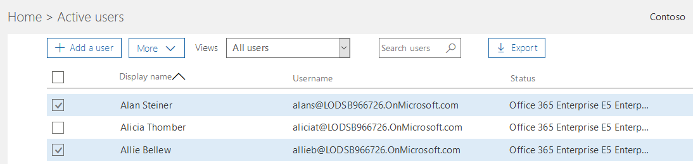
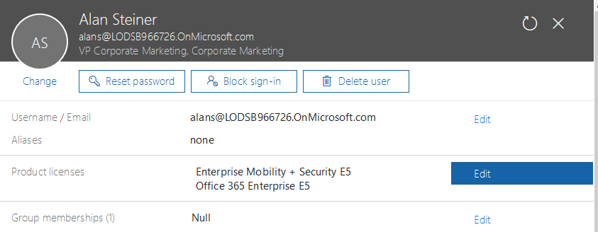

# **Lab 04 - Using the M365 Admin Portal to enable users for Microsoft Teams**

There are multiple methods you can use as an administrator to enable users for Microsoft Teams.  This method would be good for a pilot or a staged rollout of Teams.  You can also enable users individually via the Microsoft Teams and Skype for Business Admin Center or PowerShell.

The following lab will help you learn how to enable users for Teams using these two methods.  

Let's begin!

### **Exercise 01: Enabling users for Microsoft Teams using the Admin Center**

In this exercise, we will enable users from another department who were not part of the initial sales team pilot group.

>[!knowledge] Teams user-level licenses are managed directly through the Office 365 admin center user management interfaces. An administrator can assign licenses to new users when new user accounts are created, or to users with existing accounts. 

>[!note] The administrator must have Office 365 Global Administrator or User Management Administrator privileges to manage Microsoft Teams licenses!

>[!note]**Client Credentials**
    Use the following credentials to log in to **Client01**  @lab.VirtualMachine(Client01).SelectLink
    **Username:** ++@lab.VirtualMachine(Client01).Username++  
    **Password:** ++@lab.VirtualMachine(Client01).Password++

1. [ ] On **Client01** open **Internet Explorer** and navigate to the **Microsoft 365 Admin Center** (https://admin.microsoft.com/)  

    When prompted for authentication, click on the **+** before **Use another account** to enter your own tenant credentials
    
2. [ ] In the Microsoft 365 Admin Center, on the left side menu, navigate to **Users** then **Active Users**

    

3. [ ] Under **Active Users** check the box next to **Alan Steiner**  

    

4. [ ] Alan's account info should fly out from the right.  To the right of **Product licenses**, click **Edit**.

    

5. [ ] Click the arrow next to **Office 365 Enterprise E5**.  All of the products available should drop down.

    
    
6. [ ] Scroll down to **Microsoft Teams**.  Set the Toggle switch to **On**.
    

7. [ ] Save your changes by scrolling down to the bottom and clicking **Save**.
    
    
Great work!  Alan Steiner has been enabled for Microsoft Teams!   He should be able to log into the Microsoft Teams client within a few minutes.  

#### YOU HAVE COMPLETED THIS EXERCISE! 