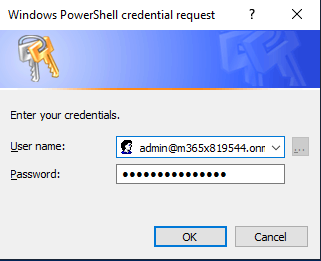
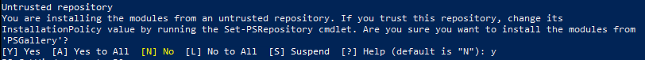
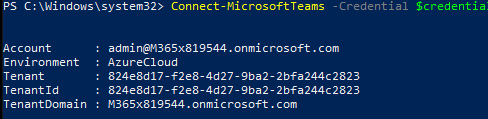
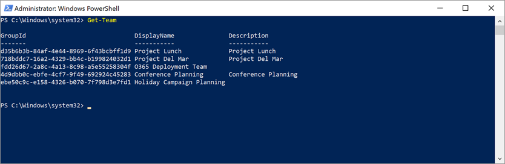
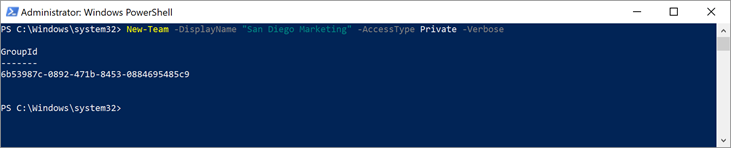
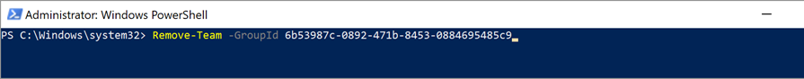

# **Lab 05 - Using PowerShell to manage Microsoft Teams**

There are multiple methods you can use as an administrator to manage Teams and settings for Microsoft Teams.  While we recommend using the Teams client exclusively for Team administration, sometimes you may need or want to change settings or take ownership of a Team at the admin level.  

The following lab will help you learn what PowerShell cmdlets are available and what are some of the tasks you can perform with them.  

Click **next** to begin!

===

>[!note] **Client Credentials**
    Use the following credentials to log in to **Client01**  
    **Username:** ++@lab.VirtualMachine(Client01).Username++   
    **Password:** ++@lab.VirtualMachine(Client01).Password++

1. [ ] Log in to **Client01** using the above credentials
2. [ ] From the Start menu or the Taskbar, open **Windows PowerShell** as an Administrator

    >[!idea] To make it easier to log in to each module, we will use a PowerShell Variable to save our Office 365 credentials for this session.

    ```powershell-notab
    $credential = Get-Credential
    ```
    Use the Office 365 Tenant credentials supplied to you in the Resource Tab to authenticate when the Windows PowerShell Logon window opens

    **O365 Admin Username:** ++@lab.TextBox(O365AdminUsername)++  
    **O365 Admin Password:** ++@lab.TextBox(O365AdminPassword)++
    
    
    
    >[!alert] ***if you close this PowerShell session window,  you will lose this variable and will need to type it in again!***

#### Install/Import the Teams PowerShell Module

3. [ ] Install the Microsoft Teams PowerShell Module
    ```PowerShell-notab
    Import-Module MicrosoftTeams
    ```
    You will get a warning to install the module from an untrusted repository.  Type in Y to confirm the installation
    
    
    
    >[!note] This message is due to the 'PSGallery' repository, where the Teams Module is currently being serviced from, is not in the default InstallationPolicy included with Windows 10.  The module is safe and you can safely ignore this message.
    
4. [ ] Connect to the Microsoft Teams Powershell Session
    
    ```PowerShell-notab
    Connect-MicrosoftTeams -Credential $credential
    ```
    Once connected successfully you should see output that is similar to this:
    
    
    
5. [ ] View the any Microsoft Teams you may already have in your environment

    ```PowerShell-notab  
    Get-Team   
    ```
    
    
    >[!note]Within PowerShell, teams are referenced as a GroupID for the underlying Office 365 Group.

#### Create a Team

6. [ ] Let's create a new Private team for marketing employees in San Diego that is a private team

    ```powershell
    New-Team -DisplayName "San Diego Marketing" -alias marketing -AccessType Private
    ```
    The team will be created with an Office 365 GroupID assigned
    
    >[!knowledge] The GroupID is important when you wish to assign classification policies to the underlying Office 365 group, in addition to when you need to remove the team among other things.

6. [ ] We can now fetch the GroupId for the newly created Office 365 group 

		Get-team

    
    
7. [ ] We can also create a team and use that to add some team members.  

		$NewTeam = New-Team -DisplayName "France Sales" -alias SalesFr -AccessType Private

		Add-TeamUser -GroupId $NewTeam.GroupId -User AdeleV@YOURTENANT.onmicrosoft.com -Role Member

		Add-TeamUser -GroupId $NewTeam.GroupId -User AlexW@YOURTENANT.onmicrosoft.com -Role Owner
	
8. [ ] To retrieve Team Users 

		Get-TeamUser -GroupId $Newteam.GroupId

>[!knowledge] This is helpful if a Team becomes orphaned without an Owner.  

#### Team Channels
9. [ ] To return the channels in a team, use the Get-TeamChannel cmdlet

		Get-TeamChannel -GroupId $NewTeam.GroupId

10. [ ] The New-TeamChannel cmdlet adds a channel to a team. For instance:

		New-TeamChannel -GroupId $NewTeam.GroupId -DisplayName "BugTracking"

11. [ ] To change a channel setting, you need to give the group identifier and the current channel name to the Set-TeamChannel cmdlet. You cannot update the settings of the General channel.

		Set-TeamChannel -GroupId $NewTeam.GroupId -CurrentDisplayName "BugTracking" -NewDisplayName "Bug Tracking" -Description "Bugs"

#### Team Settings

12. [ ] the Get-TeamMemberSettings cmdlet reveals what members can do to the structure of the team (add channels, etc.) 

		Get-TeamMemberSettings -GroupId $NewTeam.GroupId
 
13. [ ] Use the Get-TeamMessagingSettings cmdlet to see the settings that control whether users can edit or remove messages and use team and channel mentions in conversations

		Get-TeamMessagingSettings -GroupId $NewTeam.GroupId

14. [ ] To see what guest users can do in a team, use the Get-TeamGuestSettings cmdlet

		Get-TeamGuestSettings -GroupId $NewTeam.GroupId
 
15. [ ] To see the “fun stuff” settings for a team, use the Get-TeamFunSettings cmdlet

		Get-TeamFunSettings -GroupId $NewTeam.GroupId

16. [ ] Type **Set-TeamMessagingSettings**

		Set-TeamMessagingSettings -GroupId $NewTeam.GroupId -AllowTeamMentions $False

#### Remove a Team
17. [ ] To remove the team, type the following and press Enter. Where <GroupID> is the GroupID of the team you created

		Remove-Team -GroupId $Newteam.GroupId
    
    
    
===
#### YOU HAVE COMPLETED THIS EXERCISE! 