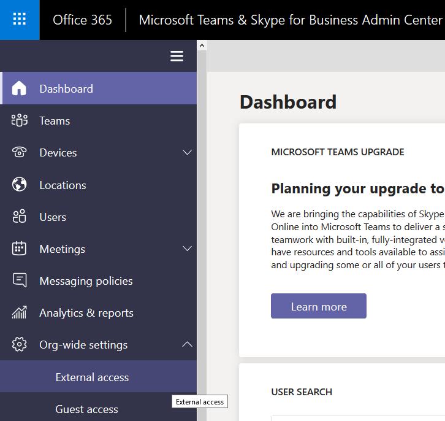
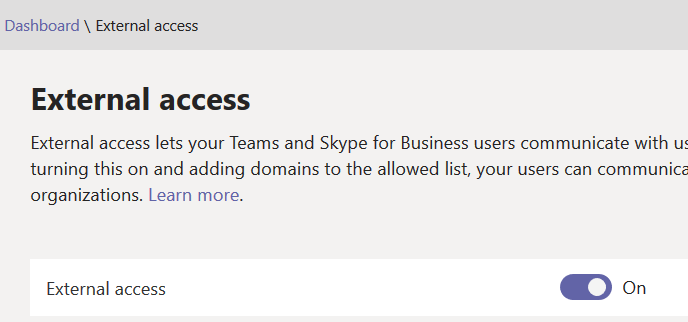
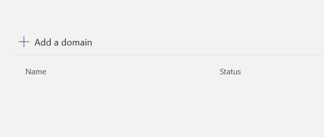
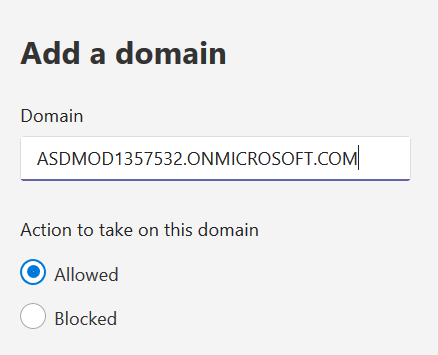
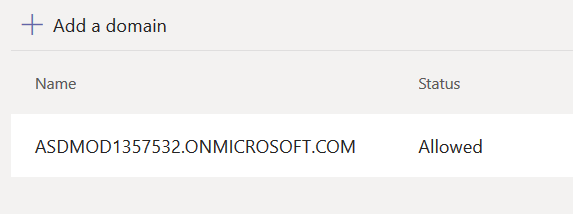

# Lab 06 - Configure External Access Settings in Microsoft Teams

The following lab will help you learn how to allow external organizations' users to find, call, and send instant messages, as well as set up meetings with your users.

Click **next** to begin!

===

>[!note] **Client Credentials**
    Use the following credentials to log in to **Client01**  
    **Username:** ++@lab.VirtualMachine(Client01).Username++   
    **Password:** ++@lab.VirtualMachine(Client01).Password++

1. [ ] Log in to **Client01** using the above credentials

2. [ ] On **Client01** open **Internet Explorer** and navigate to the **Microsoft Teams and Skype for Business Admin Center** (https://admin.teams.microsoft.com/)  

    When prompted for authentication, click on the **+** before **Use another account** to enter your own tenant credentials
    
3. [ ] In the Microsoft Teams and Skype for Business Admin Center, on the left side menu, navigate to **Org-wide Settings** then **External Access**

    

4. [ ] At the top of the External access page, toggle **External acces** to **On**.

    

>[!knowledge] If you wanted to allow **all** Teams organizations to communicate with users in your organization, you would not need to do anything else and you could just click Save. However, your security admins have asked that you limit external access to just one specific partner domain. 

5. [ ] Find a fellow classmate and get their tenant domain (e.g ASDMOD2333576.onmicrosoft.com).

6. [ ] Click the **+** in front of **Add a domain**
    

7. [ ] A flyout window should appear on the right.  In the **Domain** field, type in the partner domain.                     

8. [ ] You can choose the action to take on this domain **(Allowed or Blocked)** then click **Done**.

9. [ ] The domain you entered will be listed along with it's status.
    
    
>[!knowledge] Outside of this lab, the admin in the other Teams organization would need to perform the same steps. For example, in their allowed domains list, their admin needs to enter the domain for your business (if they limit which organizations can communicate with their users).  

>[!knowledge] You are free to test this live with another classmate or with your own domain, if you choose, but it can take up to 24 hours to take effect.  Therefore, we are not making that a mandatory step in these labs.  

#### YOU HAVE COMPLETED THIS LAB! 

