# Lab 08 - Configure Audio Conferencing

If you remember the lesson, Dedicated phone numbers are those phone numbers that are only available to users within your organization. You can also change the languages that are used when someone calls in to one of these numbers.  

In this lab, you will obtain a new service phone number from Microsoft 365, then configure a dedicated conference bridge phone number and make it the default conferencing number for Contoso.  In the second exercise, you will apply it to a single user.  

>[!Note] This lab will focus on using service numbers from Microsoft 365.  The process is a bit different if you are transferring a number from your existing PSTN provider.  Contact Microsoft support for more information on the process to transfer a service number to Microsoft 365.  

Click **next** to begin!

===

>[!note] **Client Credentials**
    Use the following credentials to log in to **Client01**  
    **Username:** ++@lab.VirtualMachine(Client01).Username++   
    **Password:** ++@lab.VirtualMachine(Client01).Password++

#### Exercise #1 - Create a new Service Phone Number

1. [ ] Log in to **Client01** using the above credentials

2. [ ] On **Client01** open **Internet Explorer** and navigate to the **Microsoft Teams and Skype for Business Admin Center** (https://admin.teams.microsoft.com/)  

    When prompted for authentication, click on the **+** before **Use another account** to enter your own tenant credentials
    
3. [ ] In the Microsoft Teams and Skype for Business Admin Center, on the left side menu, navigate and click on **Legacy Portal**.

    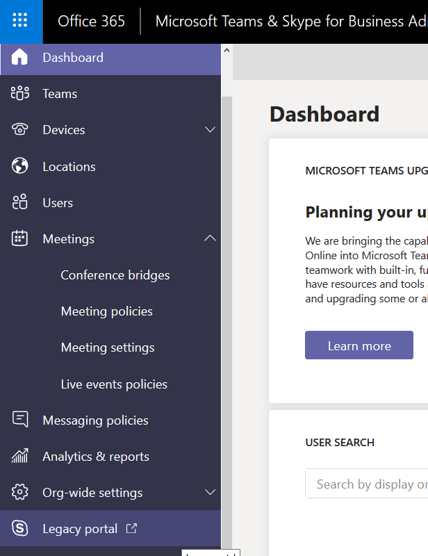
    
4. [ ] The Skype for Business admin center will launch in a new window or tab.  In the left navigation click on **Voice** 
    
    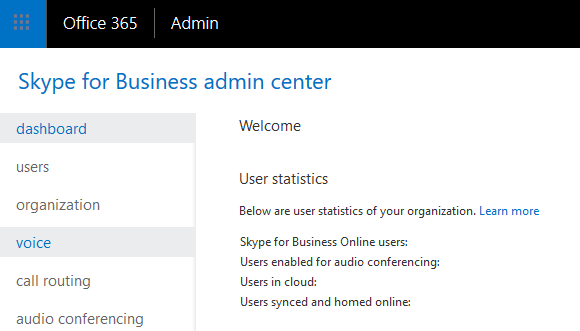
    
5. [ ] Under **Phone Numbers** Click on the **+** to create a new number.  
    
    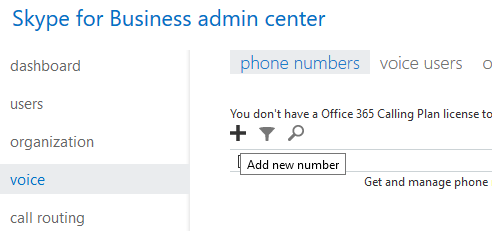
    
6. [ ] In the dropdown menu choose **New Service Numbers**

    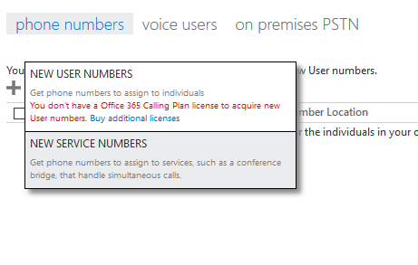
    
7. [ ] Choose your **country or region**, **State/Region** and **City** desired.  In our example below, we are choosing the United States, Wisconsin and Green Bay.

    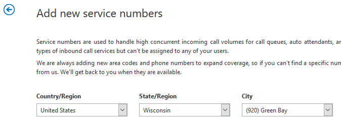
    
8. [ ] Under **Quantity**, Ensure that the **Total Service numbers that you can acquire** is over **0**.  Type in **1**, then click **Add**.

    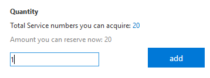
    
    It may take a minute for the number selection to finish...  
    
    
    
9. [ ] You can view the number generated by clicking on **Show Numbers**.
    
    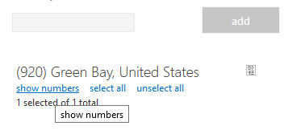
    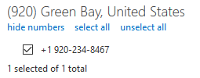
    
10. [ ] Click **Acquire Numbers** to select the number

    
    
   >[!alert] Make sure you complete this step within the next 10 minutes, or you will have to start over again!  
   
    
11. You should now see the phone number you chose listed under **Phone Numbers**

    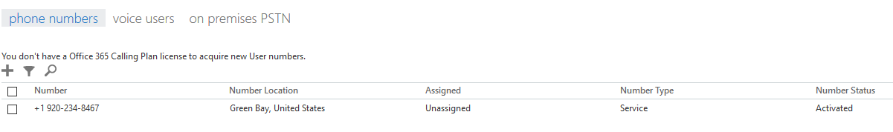
    
    Click **Next** to continue on to assign that number to the conferencing bridge service
    
===
#### Exercise #2 - Assign a service number as a dedicated conference bridge

1. [ ] On **Client01** open **Internet Explorer** and navigate to the **Microsoft Teams and Skype for Business Admin Center** (https://admin.teams.microsoft.com/)  

    When prompted for authentication, click on the **+** before **Use another account** to enter your own tenant credentials
    
2. [ ] In the Microsoft Teams and Skype for Business Admin Center, on the left side menu, navigate to **Meetings** then click on **Conference Bridges**.

    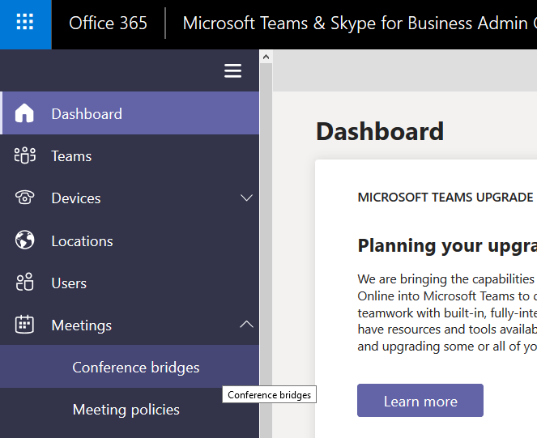

3. [ ] In the Conference Bridges frame, click **Add**, then choose **Toll Number** from the dropdown menu.

    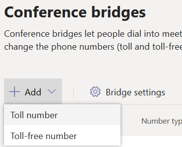
    
4. [ ] In the flyout window to the right, under **Toll Number**, **click the dropdown menu** and select the new service number you created in the last exercise.
    
    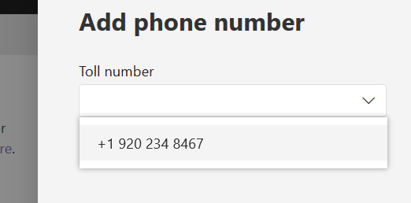
    
    Click **Save**
    
5. [ ] You should see the new **dedicated** phone number in the list of conference bridge numbers.  You may need to sort by Category to find it. 

    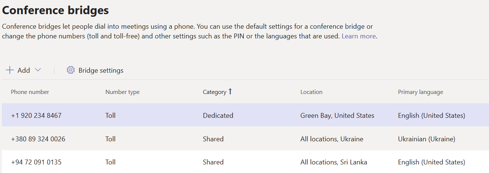
    
6. [ ] Click on the **new dedicated number** and then click **Set as Default** in the menu above. 
    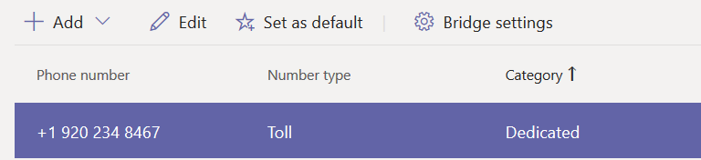
    
    >[!note] This will make the phone number the default for the entire organization, regardless of location.
    
>[!knowledge] If you click on **Bridge Settings**, you can configure tenant wide settings for your Conference Bridges. This section allows you to configure settings like:    - Meeting entry and exit notifications    - Entry/Exit Announcement Type    - Asking callers to record their name before joining a meeting    - Pin Length    - Email users if Dial-in conferencing settings change     
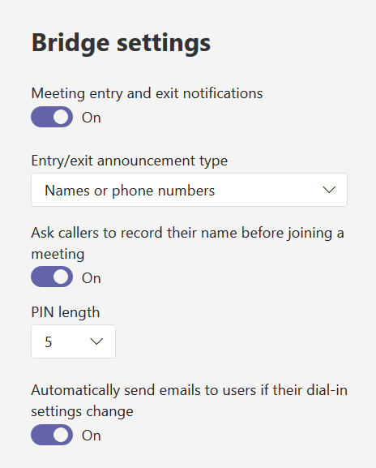

>[!knowledge] If you click on **Edit**, you can configure the default and alternate languages used by the conferencing bridge's auto attendant. Alternate languages will be presented to users in the order listed here.
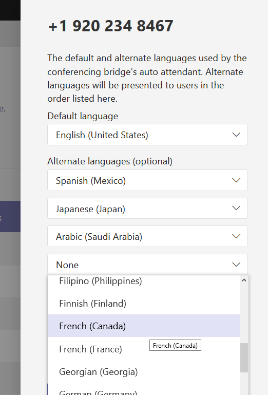

Click **Next** to continue on to assign that number to the conferencing bridge service
    
===
#### Exercise #2 - Modifying a User's Audio Conferencing Settings

>[!knowledge] Typically users are enabled for Conference Bridges by default on the *Office 365 Enterprise E5* plan.  Your own organization's licensing plan may be different.    
You can choose to enable users individually for Audio Conferencing via the Microsoft 365 Admin Center    
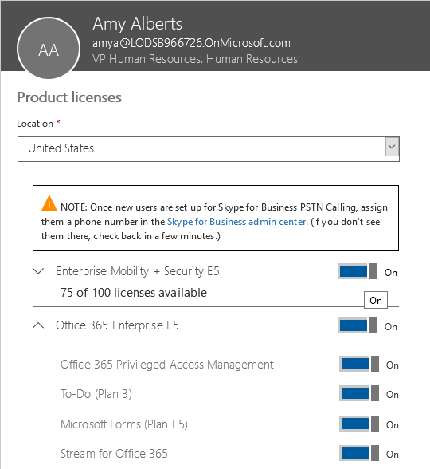

In this lab, User Amy Alberts, who is your VP of Human Resources has asked to use a local number for Audio Conferencing.  You have already acquired the number in the previous exercise.  Your security team has also requested that you restrict dial-out settings from audio conferences to just domestic numbers.  

Also, in order to save time, we will assume that the user is already licensed for Audio Conferencing before continuing on with the next step.  

2. [ ] In the Microsoft Teams and Skype for Business Admin Center, on the left side menu, navigate and click on **Users**

    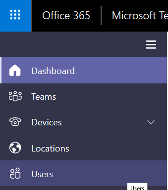
    
3. [ ] Find the and **click on** **Amy Alberts** in the list.
   
    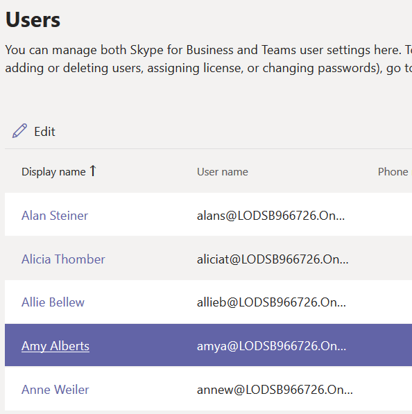
    
    
4. [ ] In Amy Alberts' properties, scroll down to **Audio Conferencing** on the right.  Click on **Edit**

    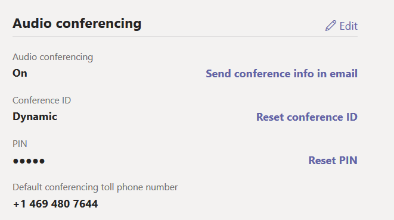
    
5. [ ] In the flyout window on the right, under **Toll Number**, use the dropdown menu and select **the new dedicated number** you just created.  

    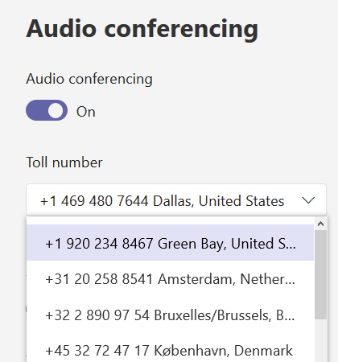
    
6. [ ] Under **Dial Out from Meetings**, use the drop down menu to select **Allow only domestic dial-out**

    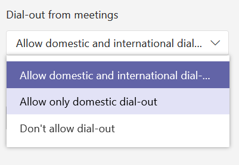
    
7.  [ ] Click **Save**

8.  [ ] You should see the new settings under the Audio Conferencing section of the frame. 

    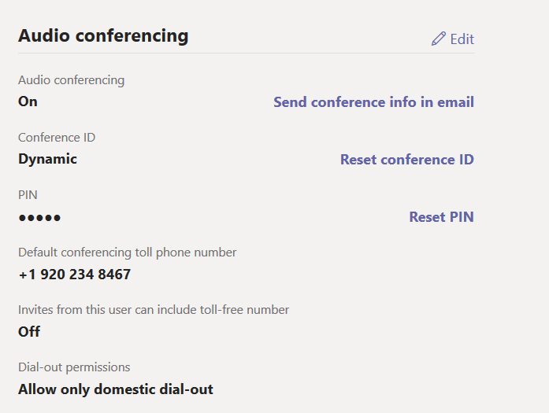

>[!knowledge] Changing the number here would only change future Meeting Invites to use the new dedicated default number.  To change existing meeting invites, you could use the Meeting Migration Service and the **Start-CsExMeetingMigration**
PowerShell cmdlet.  

#### YOU HAVE COMPLETED THIS LAB!