# Lab 10 - Managing Guest Access in Microsoft Teams

In the first lab, we had you enable Guest Access for Teams.  You did this because it can take up to 24 hours for Guest Access to take effect in your tenants.  Today, you will configure guest access controls per Contoso's security policies to ensure you can collaborate with partners securely and productively. 

Your security team has requested the following settings for Guest Access:

* Disable the ability to the Meet Now feature in Microsoft Teams
* Disable the ability to make private calls
* Disable the ability to delete or edit their channel messages
* Allow Guest Access Invites to only be sent to specific partner domains
* Force Guest Users to sign in using a Microsoft Account

Click **next** to begin!

===

>[!note] **Client Credentials**
    Use the following credentials to log in to **Client01**  
    **Username:** ++@lab.VirtualMachine(Client01).Username++   
    **Password:** ++@lab.VirtualMachine(Client01).Password++
    
#### Exercise #1 - Configure the tenant level Microsoft Teams Guest Access Settings

1. [ ] Log in to **Client01** using the above credentials

2. [ ] On **Client01** open **Internet Explorer** and navigate to the **Microsoft Teams and Skype for Business Admin Center** (https://admin.teams.microsoft.com/)  

    When prompted for authentication, click on the **+** before **Use another account** to enter your own tenant credentials
    
3. [ ] In the Microsoft Teams and Skype for Business Admin Center, on the left side menu, navigate to **Org-Wide Settings** then click on **Guest Access**.
    
    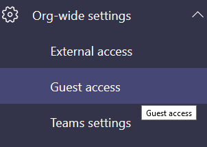

4. [ ] Scroll down to the **Calling** section of the frame.  Next to **Make private calls**, toggle the button to **Off**. 
    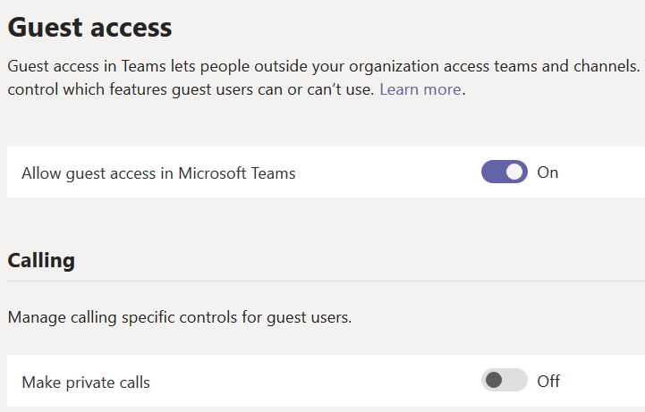

5. [ ] Scroll down to the **Meeting** section of the frame.  Next to **Allow Meet Now**, toggle the button to **Off**.
    
    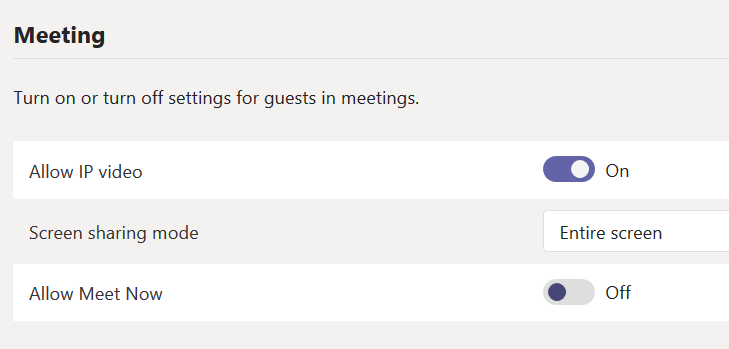
    
6. [ ] Scroll down to the **Messaging** section of the frame.  Next to **Edit sent messages**, toggle the button to **Off**.
    
7. [ ] Next to **Guests can delete sent messages**, toggle the button to **Off**.

    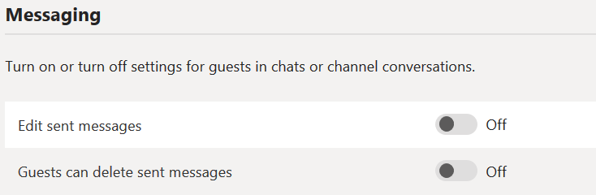

8. [ ] Click **Save** to commit the new settings.  

**YOU HAVE FINISHED THIS EXERCISE**

Click **Next** to move on to configure the Azure AD External Collaboration Settings.

===

#### Exercise #2 - Restrict collaboration to specific domains

1. [ ] In Internet Explorer, open a new tab or window and and navigate to the **Microsoft 365 Admin Center** (https://admin.microsoft.com/)  

    When prompted for authentication, click on the **+** before **Use another account** to enter your own tenant credentials
    
2. [ ] Click **Admin Centers** in the left navigation pane, and then select **Azure Active Directory**. A new window will open.  If prompted, log in using the **cloud credentials** for your tenant, located in the Resource Tab.
 
    
    
3. [ ] In the Azure Active Directory Admin Center left pane, under **Favorites** click **Users** to open the Azure AD User management pane

    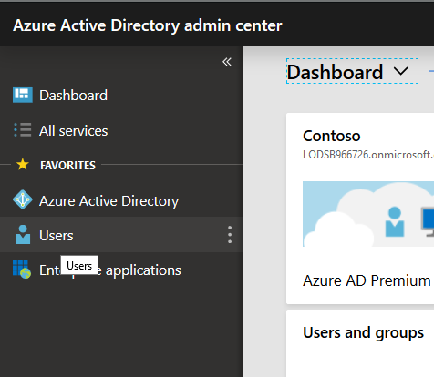
 
4. [ ] In the Users menu on the left, click **User Settings**, then in the new frame, under **External Users**, click **Manage external collaboration settings**.
    
    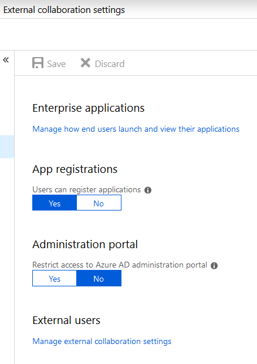

5. [ ] Under **Collaboration restrictions** select the radio button next to **Allow invitations only to the specified domains (most restrictive)**.  Then, under **Target Domains**, type in **fabrikam.com**.

    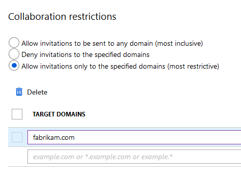

6. [ ] Click **Save**

**YOU HAVE FINISHED THIS EXERCISE**

Click **next**

===
    
#### Exercise #3 - Configure the tenant level Microsoft Teams Guest Access Settings

Great work!  Let's recap what we have done so far.  Your security team requested and you completed configuring these settings for Guest Access.  

**~~Disable the ability to the Meet Now feature in Microsoft Teams~~** 

**~~Disable the ability to make private calls~~**

**~~Disable the ability to delete or edit their channel messages~~** 

**~~Allow Guest Access Invites to only be sent to specific partner domains~~**  

That leaves only one setting left to configure....
* Force Guest Users to sign in using a Microsoft Account

Let's begin!

1. [ ] In Internet Explorer, open a new tab or window and and navigate to the **Microsoft 365 Admin Center** (https://admin.microsoft.com/)  

    When prompted for authentication, click on the **+** before **Use another account** to enter your own tenant credentials
    
2. [ ] Click **Settings** in the left navigation pane, and then select **Security and Privacy**. 

    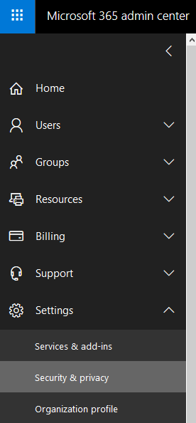

3. [ ] In the Security and Privacy frame, scroll down to **Sharing**, then click **Edit**

    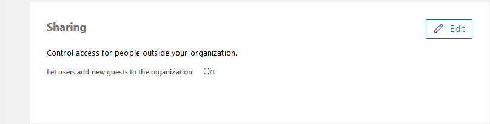
    
4. [ ] In the flyout window on the right.  Ensure the toggle switch next to **Let users add new guests to the organization** is set to **On** *(If not, go ahead and set it to **On**)*

    Under **To change your external sharing settings for SharePoint, you need to go to...**, click on **Site Settings**

    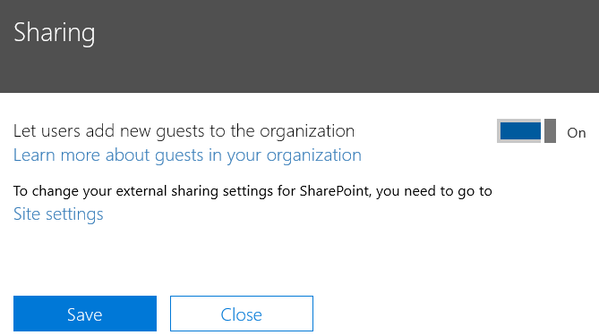
    
5. [ ] In the External Sharing flyout window, ensure that the toggle switch next to **Let users share SharePoint Online and OneDrive for Business content with people outside the organization** is set to **On** *(If not, go ahead and set it to **On**)*

    Under **Users can share with:** select **New and existing external users (sign-in required)**.  Then click **Save**.
    
    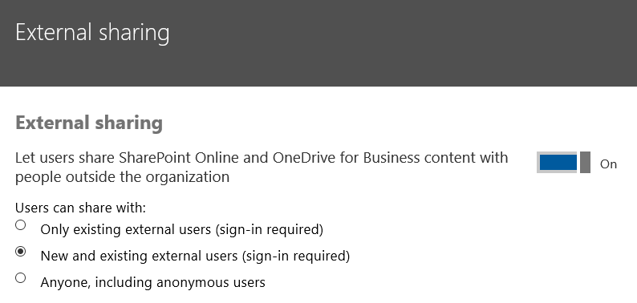
    
    
**YOU HAVE COMPLETED THIS LAB**