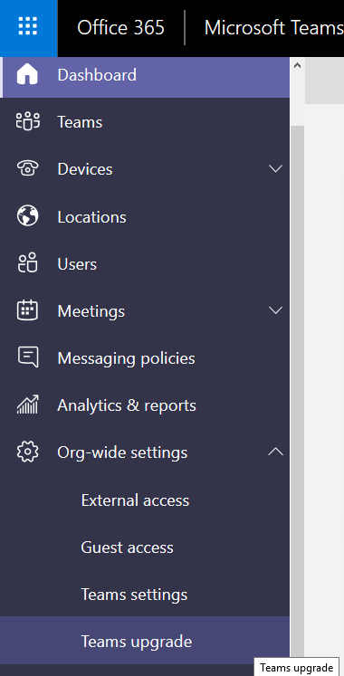
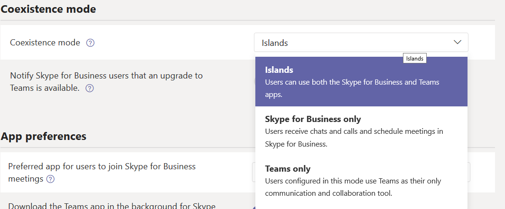
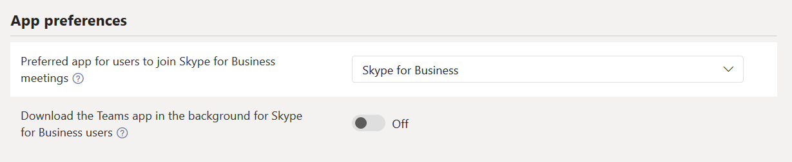
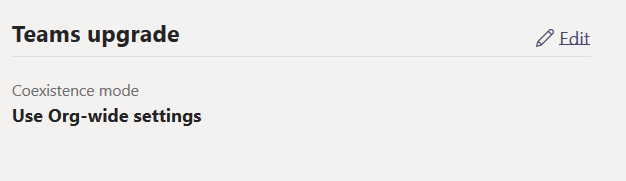
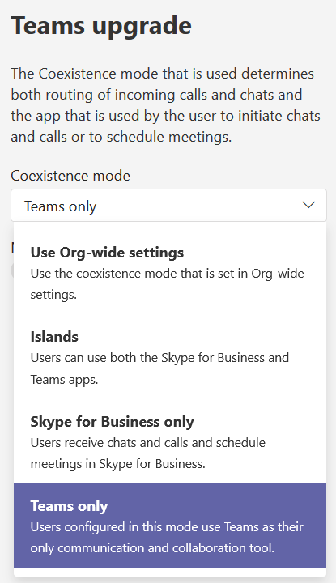

# Lab 11 - Microsoft Teams Coexistence Modes

For this lab, you already have enabled Microsoft Teams in Office 365 for your organization. You also use Skype for Business Online and would like to begin the process to migrate your users to Microsoft Teams. 

During this process, some users will be hosted on Skype for Business Online, some other will be hosted on Microsoft Teams: this is called *coexistence*. 

You have decided to set the Tenant Coexistence Mode to **Islands Mode** during the coexistence period of your project, but will notify users that Teams is coming soon.  This will set all incoming VOIP calls and chats to land in same client as the originating client.  You have also decided to migrate your pilot users to *Teams Only Mode*.  

>[!note] **Client Credentials**
    Use the following credentials to log in to **Client01**  
    **Username:** ++@lab.VirtualMachine(Client01).Username++   
    **Password:** ++@lab.VirtualMachine(Client01).Password++
    
#### Exercise #1 - Configure the tenant level Coexistence Mode

1. [ ] Log in to **Client01** using the above credentials

2. [ ] On **Client01** open **Internet Explorer** and navigate to the **Microsoft Teams and Skype for Business Admin Center** (https://admin.teams.microsoft.com/)  

    When prompted for authentication, click on the **+** before **Use another account** to enter your own tenant credentials
    
3. [ ] In the Microsoft Teams and Skype for Business Admin Center, on the left side menu, navigate to **Org-Wide Settings** then click on **Teams upgrade**.

    
    
4.	[ ] Under **Coexistence Modes** review the options listed in the drop-down menu and select **Islands**
    
    

5. [ ] Next to **Notify Skype for Business users that an upgrade to Teams is available**, toggle the button to **On**.

    
6. [ ] Under **App Preferences** Ensure the **Preferred app for users to join Skype for Business meetings** is set to **Skype for Business**
    
7. [ ] Next to **Download the Teams app in the background for Skype for Business users**, toggle the button **Off**.
   
   

     Click **Save**

>[!knowledge]  In your organization, you may want to allow the Teams App to download automatically to prepare for the move to Teams Only, but for this lab, we are going to disable it. 

**YOU HAVE FINISHED THIS EXERCISE**

Click **Next** to move on to setting a co-existence mode for specific users.

===

#### Exercise 2: Setting a co-existence mode for specific users
   
3. [ ] In the Microsoft Teams and Skype for Business Admin Center, on the left side menu, Click on **Users**

4. [ ] Scroll down and click on **Anne Weiler** 

5. [ ] Scroll down to the **Teams upgrade** section on the left.  Click **Edit** to change the coexistence mode for this user.

    
    
6. Under **Teams Upgrade**, in the dropdown menu, select **Teams Only**

    
    
    Click **Save**
    
7. You should now see **Teams Only** as the Coexistence Mode under Teams Upgrade.

>[!knowledge] You could also do this using Skype for Business Online PowerShell.  The cmdlet is simply:
```powershell
Grant-CsTeamsUpgradePolicy -PolicyName UpgradeToTeams -Identity annew@tenantname.onmicrosoft.com
```
>[!knowledge] You could also do this in a bulk script using a CSV file to import the aliases into a variable

>[!knowledge] You also could also migrate the entire tenant by simply using: 
```powershell
Grant-CsTeamsUpgradePolicy -PolicyName UpgradeToTeams
```


