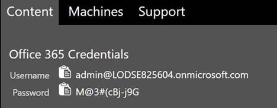
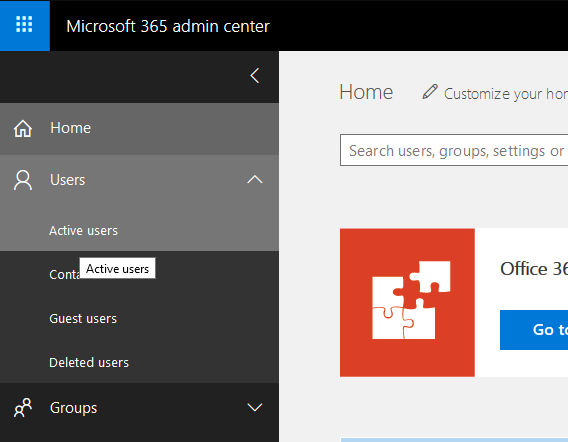
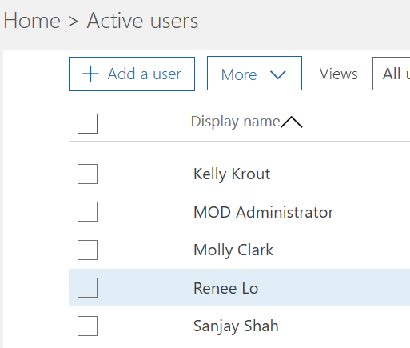
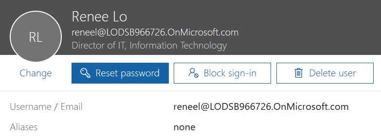
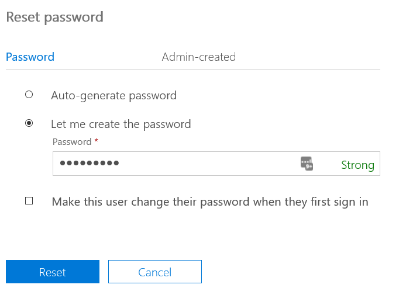
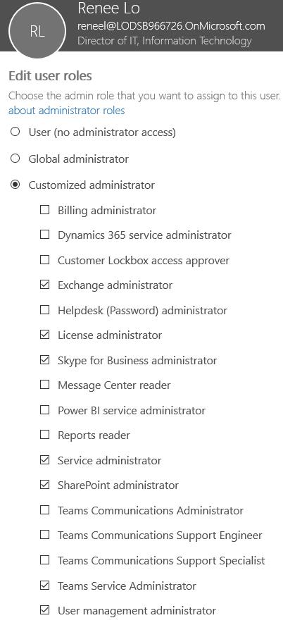
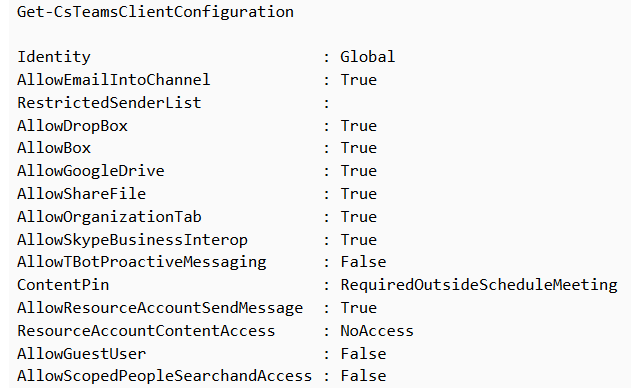

# **Lab 01 - Office 365 Management Interfaces**

## Activate Microsoft Teams Introduction

Welcome!  You are the new Teams Administrator for Contoso Corp!  In your new role, you will deploy and manage Microsoft Teams for Contoso.  The following labs will help you learn how to perform the tasks required of a Microsoft Teams Administrator. Let's begin!

To help you get started quickly, we have already enabled your Microsoft 365 Tenant and credentials for access.  You are a Global Administrator of all functions within Office 365 and Azure Active Directory.  Your Tenant credentials are listed under the **Content** tab in the LOD environment.  
___

>[!alert] ***Your credentials will look similar to this, but these are **NOT YOUR CREDENTIALS!!***



**Estimated Time:** 10 minutes 

**Objectives:** 
This lab focuses on the following tasks:
* Adding your IT administrator account into the Teams Service Administrator Group
* Preparing your workstation to administer Microsoft Teams and it's dependencies
* Preparing the Microsoft 365 Tenant for future labs
<br>
<br>
>[!hint]When you see the copy icon ++_++ You can copy the highlighted text into the lab.  
<br>
<br>
Click **Next** to continue...

===

#### **Exercise 01: Setup Renee Lo for administrative access**
In this exercise you will be introduced to the management interfaces that are available in Microsoft 365 for managing Microsoft Teams and then prepare them for use in later labs.

**Client Credentials**
    Use the following credentials to log in to **Client01**  

>[!hint] If you see this icon @lab.VirtualMachine(Client01).SelectLink  
**click** it to automatically switch to that machine in the lab!  

>[!note]**Client Credentials**
    Use the following credentials to log in to **Client01**  @lab.VirtualMachine(Client01).SelectLink
    **Username:** ++@lab.VirtualMachine(Client01).Username++  
    **Password:** ++@lab.VirtualMachine(Client01).Password++

1. [ ] Log in to **Client01** using the above credentials

2. [ ] On **Client01** open **Internet Explorer** and navigate to the **Microsoft 365 Admin Center** (https://admin.microsoft.com/)  

    When prompted for authentication, click on the **+** before **Use another account** to enter your own tenant credentials
    
2. [ ] In the Microsoft 365 Admin Center, on the left side menu, navigate to **Users** then **Active Users**

    

3. [ ] Under **Active Users** click on **Renee Lo**

    

4. [ ] Renee's account info should fly out from the right.  Click on **Reset Password**.

    
    
5. [ ] Choose **Let me create the password**. Then type in the password **P@ssword1**.

    

>[!note] Yes, we know that is not a secure password.  You should never use this as a password.  However, this is a lab, and we want to keep this simple for you, plus, it let's us easily insert the password with a single click. <br> <br> Would you rather have to type in a password like *384kdjh&^$jdk39aslBob?*.  <br> <br>
If it really bothers you, use whatever password you want to use, just ensure that you can remember it for later labs and know that the password insert feature will not work for you. :smiley:

6. [ ] Click **Reset** to reset the password. 

>[!note] If you decide to test features with any other users in this lab, you will need to repeat these steps as the passwords are all randomly set by our lab provider.  

7. [ ] While still viewing Renee's user settings frame, next to **Roles** and **User (no admin access)**, click on **Edit**.  

8. Under **Edit user roles**, select **Customized Administrator**.  Then click the **checkbox** next to the following admin roles:

* Exchange administrator
* License administrator
* Skype for Business administrator
* Service administrator
* SharePoint administrator
* Teams Service Administrator
* User management administrator

    

Click **Save** when finished. 

#### YOU HAVE FINISHED THIS EXERCISE

Click **Next** to continue to the next exercise.

===

#### **Exercise 02: Set up the Teams and Skype for Business PowerShell modules**

1. [ ] From the Start menu or the Taskbar, open **Windows PowerShell** as an Administrator

    >[!note] To make it easier to log in to each module, we will use a PowerShell Variable to save our Office 365 credentials for this session.

    ```powershell-notab
    $credential = Get-Credential
    ```
    Use the Office 365 Tenant credentials supplied to you in the Resource Tab to authenticate when the Windows PowerShell Logon window opens

    **O365 Admin Username:** ++@lab.TextBox(O365AdminUsername)++  
    **O365 Admin Password:** ++@lab.TextBox(O365AdminPassword)++

    
    
    >[!alert] ***if you close this PowerShell session window,  you will lose this variable and will need to type it in again!***

3. [ ] Import the Microsoft Office 365 Online PowerShell Module
    ```PowerShell-notab
    Import-Module MSOnline
    ```

4. [ ] Connect to the MSOnline Session by typing this cmdlet:
    ```PowerShell-notab
    Connect-MsolService -Credential $credential
    ```

5. [ ] Test the MSOnline PowerShell Module by typing the following cmdlet:  
    ```PowerShell-notab
    Get-MSOLAccountSku
    ```
    You should see a listing of the Account SKUs (Licenses) assigned to your tenant similar to this:
   
  
6. [ ] Import the AzureAD PowerShell Module
    ```PowerShell-notab
    Import-Module AzureAD
    ```
7. [ ] Connect to the AzureAD Powershell Session by typing this cmdlet:
    ```PowerShell-notab
    Connect-MsolService -Credential $credential
    ```

8. [ ] Test the AzureAD PowerShell Module by typing the following cmdlet:
    ```PowerShell-notab
    Get-MSOLDOMAIN
    ```
    You should see a listing of AzureAD Domains in tenant similar to this:
    
    
9. [ ] Install the Microsoft Teams PowerShell Module
    ```PowerShell-notab
    Import-Module MicrosoftTeams
    ```
    You will get a warning to install the module from an untrusted repository.  Type in Y to confirm the installation
    
    
    
    >[!note] This message is due to the 'PSGallery' repository, where the Teams Module is currently being serviced from, is not in the default InstallationPolicy included with Windows 10.  The module is safe and you can safely ignore this message.
    
10. [ ] Connect to the Microsoft Teams Powershell Session
    ```PowerShell-notab
    Connect-MicrosoftTeams -Credential $credential
    ```
    Once connected successfully you should see output that is similar to this:
    
    
11. [ ] View the any Microsoft Teams you may already have in your environment
    ```PowerShell-notab
    Get-Team  
    ```
    You should see output that is similar to this:
    
    
    Notice that this cmdlet by default shows you the O365 *GroupID*, *DisplayName* of the Team and the *description* of the Team as entered when the Team was created.  The GroupID is important as most of the TeamsPowerShell and AzureAD cmdlets require it when referencing a Team.
    
12. [ ] Create a new team for marketing employees in San Diego that is a private team

    ```powershell
    New-Team -DisplayName "San Diego Marketing" -alias marketing -AccessType Private
    ```
    
13. [ ] We can now fetch the GroupId for the newly created Office 365 group. 

    ```powershell
    Get-team
    ```

    Note or copy the **GroupID** for this new team.  You will need it to add members to your group in the next step. 
    
14. [ ] Let's create another Team, and add some members.  We can use a variable to help us save time by not having to type in the GroupID for each new Team member.  
	```powershell
    $NewTeam = New-Team -DisplayName "France Sales" -alias SalesFr -AccessType Private
    Add-TeamUser -GroupId $NewTeam.GroupId -User AdeleV@YOURTENANTNAMEHERE.onmicrosoft.com -Role Member
    Add-TeamUser -GroupId $NewTeam.GroupId -User AlexW@YOURTENANTNAMEHERE.onmicrosoft.com -Role owner
```

15. [ ] Verify that the members were entered successfully...  
    ```powershell
    Get-TeamUser -GroupId $Newteam.GroupId
    ```
   
Leave the PowerShell Window open for the next exercise.

#### YOU HAVE COMPLETED THIS EXERCISE  

Click **Next** to continue...

===

#### **Exercise 02: Enable Guest Access to Microsoft Teams**  

In this exercise you will use the *Skype for Business Online PowerShell Module* to enable Guest Access to Microsoft Teams for use in a later labs.  We cover Guest Access in detail later, but this Exercise is required today because it takes 2-24 hours to provision the tenant for Guest Access.

**DO NOT SKIP THIS EXERCISE!!!**

1. [ ] Connect the current PowerShell session to the Skype for Business Online endpoint using the following:

    ```powershell
    Import-Module SkypeOnlineConnector
    $CSSession = New-CsOnlineSession -Credential $credential
    Import-PSSession -Session $CSSession
    ```
2. [ ] Check if Guest Access is enabled with this cmdlet:

    ```powershell
    Get-CsTeamsClientConfiguration
    ```
    Look at the output of the cmdlet.  Specifically, look for the **Allow Guest User** setting.  If the value is set to **False**, you will need to enable it in the next step.  
    
    
    
    **If the value is True, you are finished with this Exercise.**
    
3. [ ] Type in the following cmdlet to enable Guest Acces for the organization. 

    ```powershell
    Set-CsTeamsClientConfiguration -AllowGuestUser $True -Identity Global
    ```
4. [ ] Again, check to ensure that Guest Access is enabled.  Ensure that the **Allow Guest User** setting      is set to **True**

    ```powershell
    Get-CsTeamsClientConfiguration
    ```
    

Leave the PowerShell Window open for the next exercise.


Click **Next** to continue...

===

#### **Exercise 03: Disable Microsoft Teams for all users**  
In this exercise, you will disable Microsoft Teams for all of the users in the Tenant using a PowerShell script that we have provided.  

Why are we doing this??  Microsoft Teams is enabled by default in all new Microsoft 365 tenants.  You are working with brand new active tenants that we have generated for you.  Because of this, we need to disable Microsoft Teams for all users, so that you can learn how to enable them in a later lab.  

**DO NOT SKIP THIS EXERCISE!!!**

1. [ ] In the PowerShell window, cut and paste this script into the window.  Press **Enter** after pasting to run the script. 

```powershell
#Connect to Office 365 MOD Tenant
Connect-AzureAD -Credential $Credential

#Get the AzureAD SKU ID - We need this because the tenantname (and possibly the SKU) will be different every time 
$users = Get-AzureADUser -All:$true | ? {$_.AssignedLicenses}
$SKUs = Get-AzureADSubscribedSku

#This GUID is the Microsoft Teams SKU GUID
$plansToDisable = @("57ff2da0-773e-42df-b2af-ffb7a2317929","getENTERPRISEPREMIUM")

#Get and create a new License Plan Variable 
foreach ($user in $users) {
    $userLicenses = New-Object -TypeName Microsoft.Open.AzureAD.Model.AssignedLicenses
    foreach ($license in $user.AssignedLicenses) {
        $SKU =  $SKUs | ? {$_.SkuId -eq $license.SkuId}
        foreach ($planToDisable in $plansToDisable) {
            if ($planToDisable -notmatch "^[{(]?[0-9A-F]{8}[-]?([0-9A-F]{4}[-]?){3}[0-9A-F]{12}[)}]?$") { $planToDisable = ($SKU.ServicePlans | ? {$_.ServicePlanName -eq "$planToDisable"}).ServicePlanId }
            if ($planToDisable -in $SKU.ServicePlans.ServicePlanId) {
                $license.DisabledPlans = ($license.DisabledPlans + $planToDisable | sort -Unique)
                Write-Host "Removed plan $planToDisable from license $($license.SkuId)"
            }
        }
        $userLicenses.AddLicenses += $license
    }
    #Apply the user license
    Set-AzureADUserLicense -ObjectId $user.ObjectId -AssignedLicenses $userLicenses
```
Once the script finishes, the lab is complete.  You will verify this worked and enable users in a future lab.  

#### YOU HAVE COMPLETED LAB 01!  
