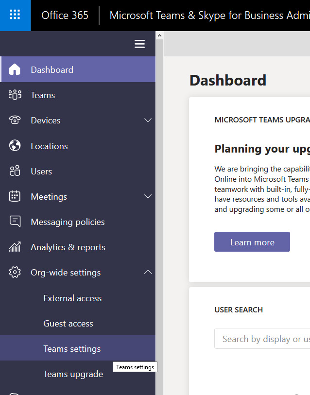
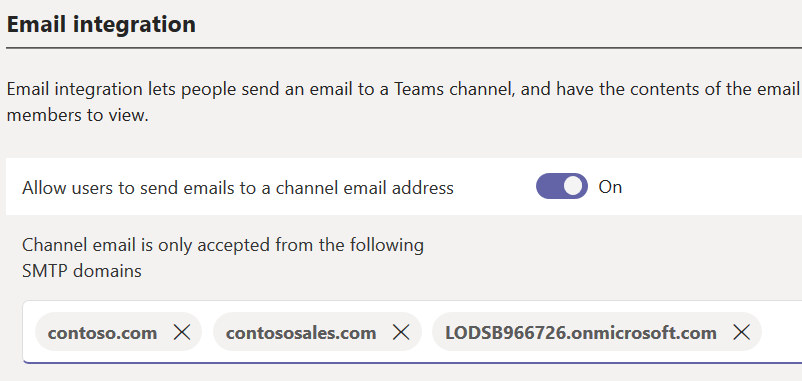
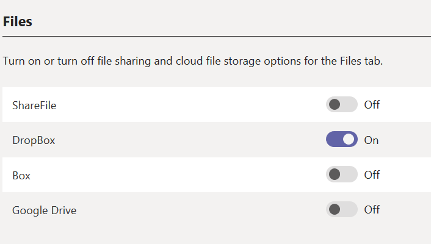

# **Lab 02: Setting Organizational level settings for Microsoft Teams**
In this exercise you will configure some of the available organizational level policies for Microsoft Teams in preparation for the rollout at Contoso. This lab will help you understand how to configure the following org-wide settings:
* Email Integration
* File Sharing & Cloud Storage

>[!note] **Client Credentials**
    Use the following credentials to log in to **Client01**  @lab.VirtualMachine(Client01).SelectLink
    **Username:** ++@lab.VirtualMachine(Client01).Username++  
    **Password:** ++@lab.VirtualMachine(Client01).Password++

#### Task 1 - Email Integration Settings

1. [ ] On **Client01** open **Internet Explorer** and navigate to the **Microsoft Teams and Skype for Business Admin Center** (https://admin.teams.microsoft.com/)  

    When prompted for authentication, click on the **+** before **Use another account** to enter your own tenant credentials
    
2. [ ] In the Microsoft Teams and Skype for Business Admin Center, on the left side menu, navigate to **Org-wide Settings** then **Teams settings**

    
    
3. [ ] In the Teams Settings frame, scroll to the **Email Integration** section.  
>[!knowledge] Here you can enable or disable Email Integration with Microsoft Teams.  Email integration lets people send an email to a Teams channel, and have the contents of the email displayed in the conversations for all team members to view.  In some cases, you may want to disable this feature.  For this lab, we are going to keep it enabled, but secure it to only the contoso SMTP domains.

4. [ ] Next to **Channel email is only accepted from the following SMTP domains**, type in the following domains:
  *(enter a space after each domain)*  
 - **++contoso.com++**   
 - **++contososales.com++**  
 - **++@cloudadmin.domain++**  
  
    You should see each domain highlighted with a circle similar to this: 
 
Great work!  Now only the domains above will be able to email a Teams Channel directly!  
 
 **TASK COMPLETE**   
 Click next to go on to the next task... 

===

#### Task 2 - File Sharing & Cloud Storage Settings

Your security team has decided to **not** allow file sharing from the following Cloud Storage providers:
- ShareFile
- Box
- Google Drive

File sharing from **DropBox** will be allowed.  

1. [ ]  Under **Files** select **Off** next to the Cloud Storage providers we will be *disabling* (***ShareFile, Box*** and ***Google Drive***).  Leave **DropBox** set to **On**.  

    

2. [ ] Scroll down to the bottom of the frame and click **Save** to commit the changes. 

### YOU HAVE COMPLETED LAB 02!  

**If others are still finishing their labs, feel free to open the Microsoft Teams client and test these settings.  It may take a few minutes to an hour for the settings to take effect.  Or, if others are still working on their labs, take a break!**

**Check with your instructor before leaving the room though!**

 **TASK COMPLETE**   

===
